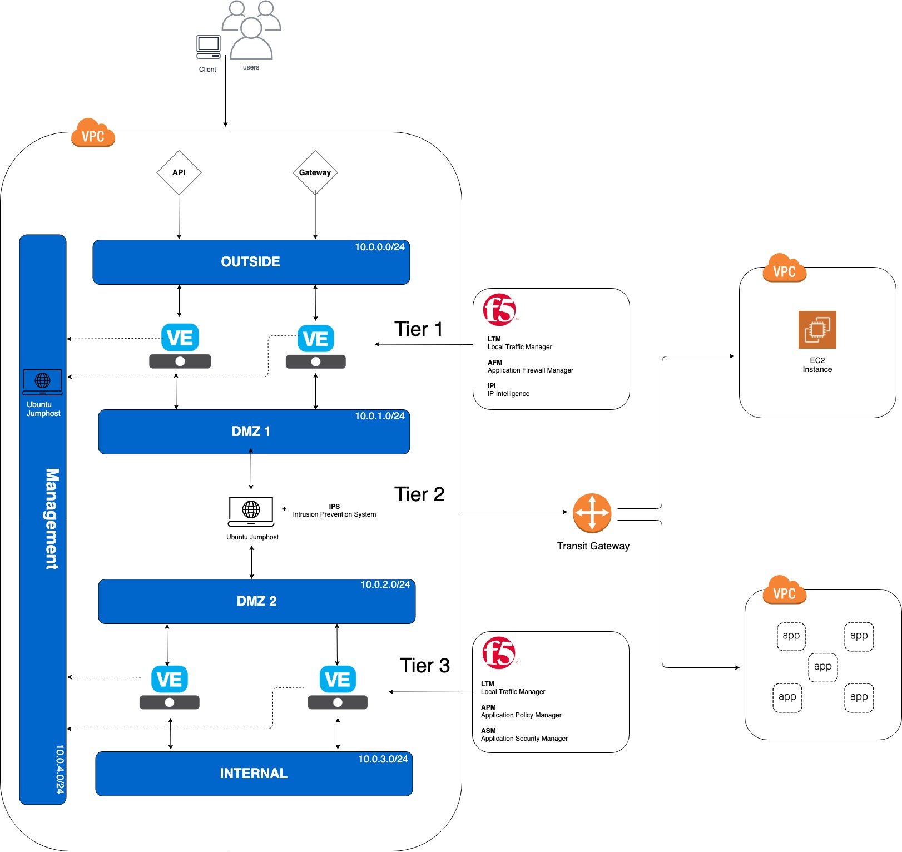

# f5-sca-securitystack

## Introduction

This README will provide a baseline introduction into the Secure Cloud Architecture (SCA). Links will be provided for more in-depth explanations.

**Under construction**

## Secure Cloud Architecture

Focusing on delivering a concept to migrate to the cloud with security as a priority, not an after thought

## Design principles

Security is built-in, …

## Business Outcomes

## What is included in this template? 

The Secure Cloud Architecture (SCA) provides a 3-Tier architecture. This architecture has the following components:

5 subnets:
	1. Management 
	2. "Outside" 
	3. DMZ #1
	4. DMZ #2 
	5. "Internal" 

Tier 1 and Tier 3 are F5 BIG-IP devices (HA via API), while Tier 2 IPS is a Ubuntu box with routing enabled. The reason of this is to allow flexibility in Tier 2 so that the customer is not locked into a F5 device. 

There is a root Cloud Formation Template (CFT) which runs 5 child-CFT's 

First, the TGW (transit gateway) and VPC (virtual private cloud) are deployed.

Second is the template for the jump host and IPS to be deployed. 

Third, BIG-IP tier 1 and tier 2 are deployed 
**Note: This is created after the jump host and IPS because 1 of the inputs to this is a private IP of the jump host

Fourth, routes are replaced utilizing lambda functions since it's not natively allowed

Lastly, the AS3 Update template updates AS3 
