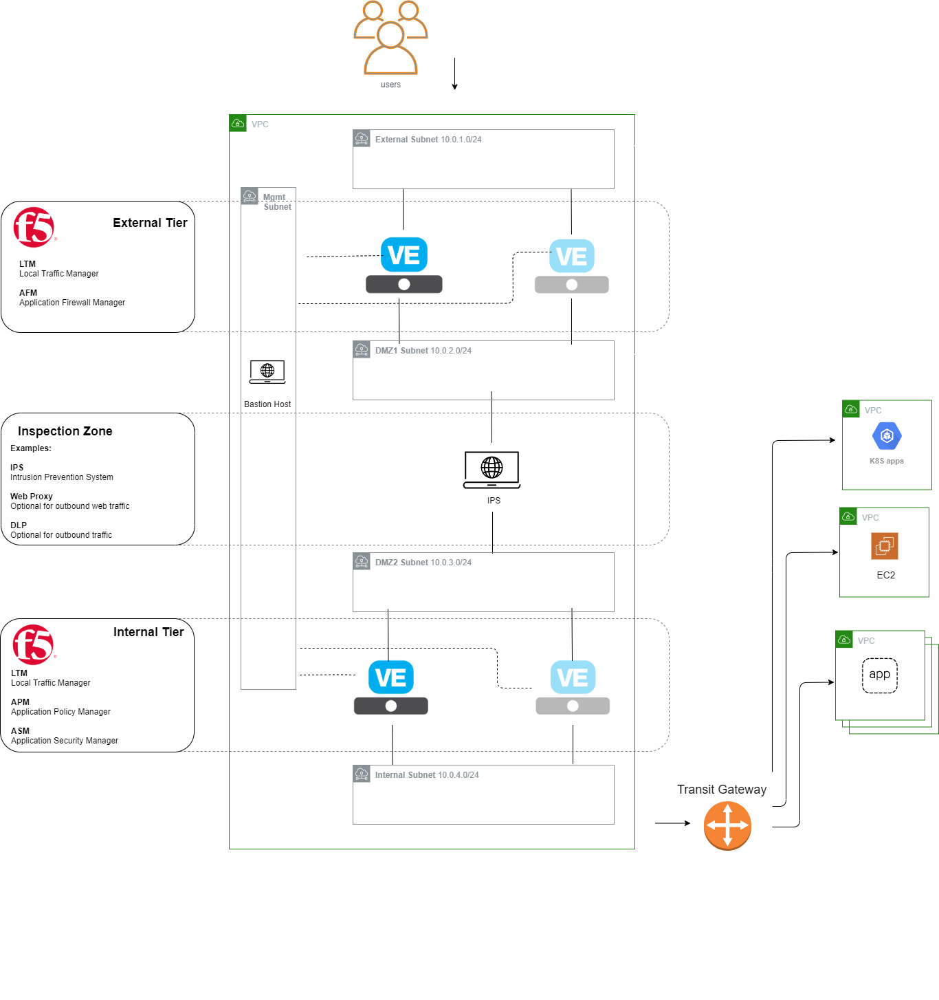
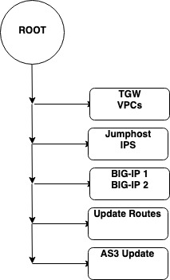
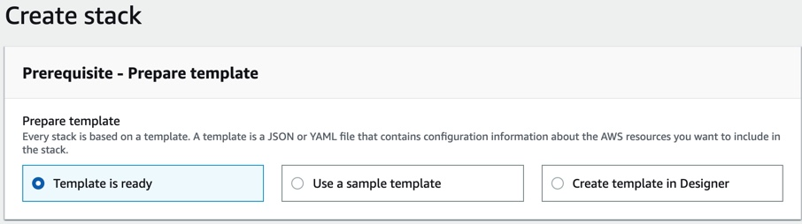
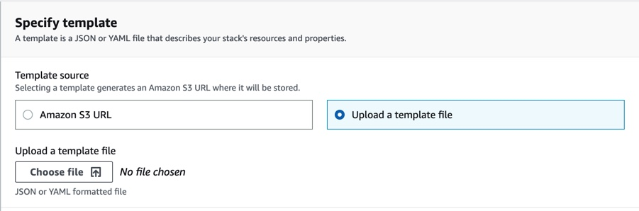
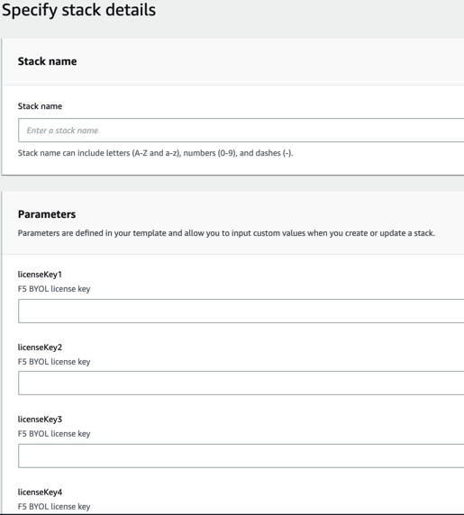
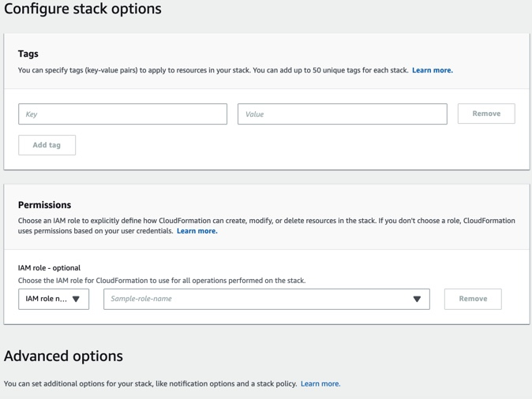
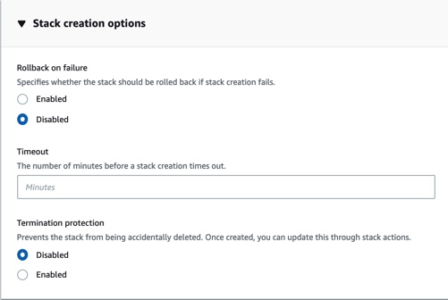
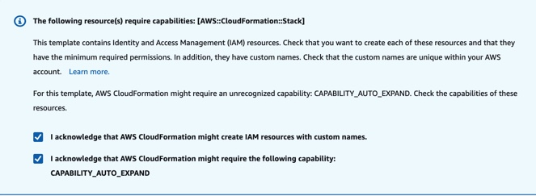

# f5-sca-securitystack

This README will provide a baseline introduction into the Secure Cloud Architecture (SCA). Links will be provided for more in-depth explanations.

## Contents
- [Introduction](#introduction)
- [What is Secure Cloud Architecture (SCA)?](#secure-cloud-architecture)
- [Design Principles](#design-principles)
- [Business Outcomes](#business-outcomes)
- [What is included in this template?](#What-is-included-in-this-template)
- [Getting Help](#help)
- [Installation](#installation)
- [Template Parameters](#template-parameters)

## Introduction

The biggest challenge in cloud computing today is the security and privacy problems caused by its multi-tenancy nature and the outsourcing of infrastructure. Enterprises are rapidly adopting cloud services for their businesses and measures need to be developed so that organizations can be assured of security in their businesses, and can choose a suitable vendor for their computing needs. 

## Secure Cloud Architecture
 
The purpose of Secure Cloud Architecture (SCA) is to provide a barrier of protection between your mission-critical apps & sensitive data and the Cloud Service Provider. Even when information resides in a Cloud Service Provider (CSP), there must be requirements to protect your information. SCA focuses on delivering a concept to migrate to the cloud with security as a priority, not an after thought.

This project originated because of the Department of Defense (DoD) requirements to protect the Defense Information System Networks (DISN) and DoD Information Networks (DoDIN), even when living in a Cloud Service Provider (CSP). Per the SCCA Functional Requirements Document, the purpose of SCCA is to provide a barrier of protection between the DISN and commercial cloud services used by the DoD.

“It specifically addresses attacks originating from mission applications that reside within the Cloud Service Environment (CSE) upon both the DISN infrastructure and neighboring tenants in a multi-tenant environment. It provides a consistent CSP independent level of security that enables the use of commercially available Cloud Service Offerings (CSO) for hosting DoD mission applications operating at all DoD Information System Impact Levels (i.e. 2, 4, 5, & 6).” 
https://iasecontent.disa.mil/stigs/pdf/SCCA_FRD_v2-9.pdf

## Design principles

Security is built-in, …

## Business Outcomes

The Application Economy is not driven by humans or physical assets. It is driven by the ability to scale and secure digital services, such as your applications. To thrive in the Application Economy, organizations need to manage, secure, and optimize their applications. 
 
Secure cloud architecture (SCA) for organizations can strengthen the security of your applications and sensitive data, thus minimizing enterprise risks. 

## What is included in this template? 

The Secure Cloud Architecture (SCA) provides a 3-Tier architecture. This architecture has the following components:

5 subnets:
1. Management 
2. "Outside" 
3. DMZ #1
4. DMZ #2 
5. "Internal" 

**Below is an image of the architecture:**     

  

External and Internal Tiers are F5 BIG-IP devices (HA via API), while the middle tier hosts a VM to emulate a 3rd party IPS vendor (in this demo, an Ubuntu box with routing enabled). The main reason this middle tier or inspection zone is included in this demo is to show how to integrate 3rd party, non-F5 security products.

There is a root Cloud Formation Template (CFT) which in turn calls multiple child CFT's.   

 

1. The TGW (transit gateway) and VPC's (virtual private cloud) are deployed.
2. The template for the jump host and IPS to be deployed. 
3. BIG-IP is deployed to make External and Internal Tiers of this architecture.
4. Default routes for the appropriate subnets are updated to point to the (active) BIG-IP or the IPS.
5. A demo app is deployed, for demonstratoin purposes.

## Help
**under construction**

## Installation

1. Navigate to your AWS Management Console.
2. Go to 'Services' -> 'CloudFormation'.
3. Click 'Create Stack' under the 'Stacks' column.
4. Under 'Prerequisite', choose 'Template is ready'.    
   
5. Under the Specify template, for 'Template source' choose 'Upload a template file'.  
   
6. Click 'choose file' and find the appropriate file on your local machine, then click next.
7. You should now see the following page:   
   
8. The 'Stack name' can be anything you choose. The stack name can include letters (A-Z and a-z), numbers (0-9), and dashes (-).
9. Fill in the appropriate information for the template parameters. For more information regarding the template parameters, [see below](#template-parameters). When you are finished with the template parameters, click 'Next'. 
10. You should now see the following page:   
   
11. Under 'Advanced Options', expand the 'Stack creation options' and click 'Disabled' for 'Rollback on failure'. Then, click 'Next'.   
   
12. You will now be on the Review page. Go ahead and review all the details to ensure it is all correct. At the very bottom of this page, under 'Capabilities' you must check the required boxes:   
   
13. Lastly, go ahead and click 'Create stack'. 
  

## Template Parameters

| Parameter | Required | Description |
| --- | --- | --- |
| BaselineCompliance | Yes | Choose your baseline compliance posture.  'Enterprise' consists of standard architecture.  'SCCA' consists of some extra layers of security. |

| Deploy Demo Apps | No | Choose Yes to have demo apps deployed in connected VPC's |
| Security VPC CIDR | Yes | CIDR Block for the VDSS VPC.    Default is '10.0.0.0/16'. |
| Demo App 1 VPC CIDR | No | CIDR Block for the app VPC. Only used if demo apps are deployed. |
| Demo App 2 VPC CIDR | No | CIDR Block for the Fargate VPC. Only used if demo apps are deployed. |
| SSH Key | Yes | EC2 SSH Key for BIG-IP and Linux images |

| licenseKey1 | Yes | BIG-IP License #1 BYOL |
| licenseKey2 | Yes | BIG-IP License #2 BYOL |
| licenseKey3 | Yes | BIG-IP License #3 BYOL |
| licenseKey4 | Yes | BIG-IP License #4 BYOL |

| Project Tag | No | Project name to use for tagging. |
| S3 Bucket Name | Yes | S3 bucket name for the Quick Start assets. Quick Start bucket name can include numbers, lowercase letters, uppercase letters, and hyphens (-). It cannot start or end with a hyphen (-).    Default is 'f5-sca-securitystack'. |
| S3 Key Prefix | Yes | Quick Start key prefix can include numbers, lowercase letters, uppercase letters, hyphens (-), and forward slash (/).    Default is 'master'. |

## Filing Issues

If you find an issue, we would love to hear about it.

- Use the **Issues** link on the GitHub menu bar in this repository for items such as enhancement or feature requests and non-urgent bug fixes. Tell us as much as you can about what you found and how you found it.

### Contributor License Agreement

Individuals or business entities who contribute to this project must have completed and submitted the F5 Contributor License Agreement.

## Development
This project uses AWS CodePipeline to build the required Lambda functions as well as generating some of the Cloudformatoin templates.

To start developing against this project please follow the below procedures:

1) Create a GitHub [Personal Access Token](https://docs.aws.amazon.com/codepipeline/latest/userguide/GitHub-create-personal-token-CLI.html)
2) Add the GitHub PAT to your AWS Secrets Manager.  **Note:** ensure the key uses the value GitHubPersonalAccessToken
3) Deploy the deploy-pipeline.template CloudFormation Template
    1. BranchName: the branch name of your Git repository - usually master unless you created a branch for development.
	2. GitHubOwner: the GitHub account owner for the repository.  This is used to build the GitHub URL to access the repository.
	3. OAuthSecretName: the name of your AWS Secrets Manager object that stores the GitHub PAT
	4. RepositoryName: the Git repository name.  This is used to build the GitHub URL to access the repository.
	5. S3Bucket: the S3 bucket you want the CFN templates and lambda files installed to. **Note:** this bucket must already exists.
	6. S3Key: the directory inside your S3 bucket that will contain the deployment artifacts. 

**F5 Networks**  
